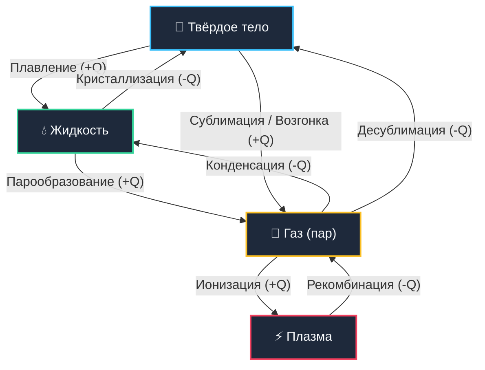

```mermaid
flowchart TD
    %% Состояния вещества
    S["🧊 Твёрдое тело"]
    L["💧 Жидкость"]
    G["💨 Газ (пар)"]
    P["⚡ Плазма"]

    %% Фазовые переходы с поглощением тепла (+Q / эндотермические)
    S -->|"Плавление (+Q)"| L
    L -->|"Парообразование (+Q)"| G
    S -->|"Сублимация / Возгонка (+Q)"| G
    G -->|"Ионизация (+Q)"| P

    %% Фазовые переходы с выделением тепла (-Q / экзотермические)
    P -->|"Рекомбинация (-Q)"| G
    G -->|"Конденсация (-Q)"| L
    L -->|"Кристаллизация (-Q)"| S
    G -->|"Десублимация (-Q)"| S

    %% Стилизация узлов под темную тему Obsidian
    style S fill:#1e293b,stroke:#38bdf8,stroke-width:2px,color:#f8fafc
    style L fill:#1e293b,stroke:#34d399,stroke-width:2px,color:#f8fafc
    style G fill:#1e293b,stroke:#fbbf24,stroke-width:2px,color:#f8fafc
    style P fill:#1e293b,stroke:#f43f5e,stroke-width:2px,color:#f8fafc
```

